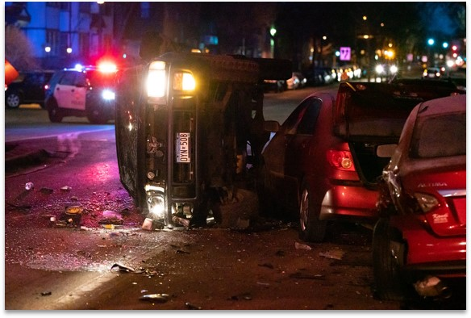
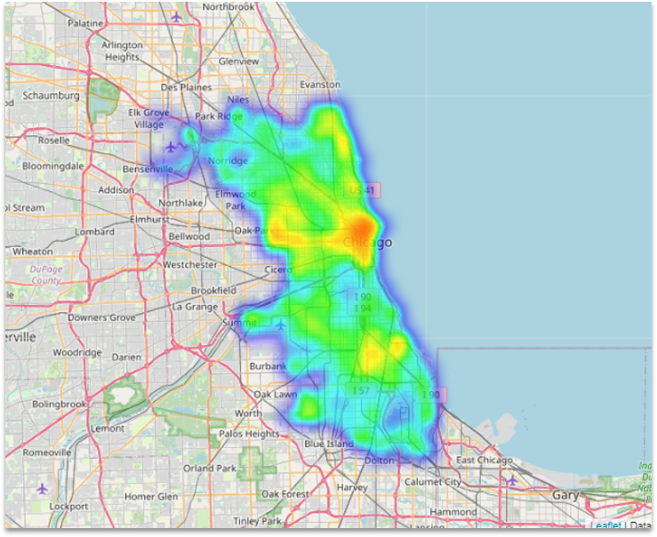
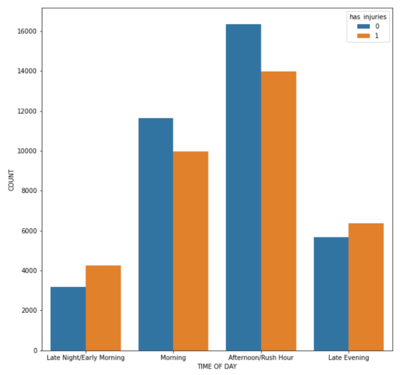
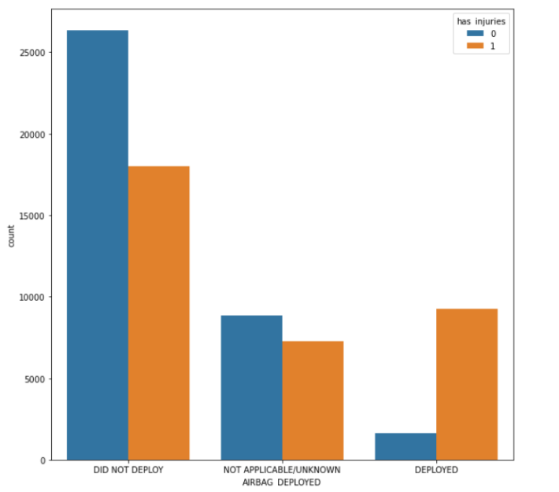

# Phase3-Project
# Chicago Car Crash



## Overview

On this project we're going to show you how we sourced, processed, modeled, and interpreted the data we acquired from Chicago's government on car accidents and how we could better save lives from it.

## Business Understanding

Our main concern was preventing fatalities and serious injuries from car crashes in Chicago. Our solution was developing key indicators that could alert local emergency services that would properly respond to any nearby accidents using our machine learning algorithm.

## Data Understanding

We had over 600,000 car accidents between October 2017 and October 2022 that we had to filter along with data that was solely focused on the driver and the cars.

Our first task was eliminating any unnecessary data that would overly encumber and slow down our algorithm as well as any unrelated features that played no informative or user input role in the algorithm. Some examples were the vehicle license plate number and the driver's zip code.

## Data Exploration

So in the exploration part, we dived deep into our data to clear the mud and see what is actually happening. In this slide we can see the frequency of accidents with injury in terms of heatmap. We can see that the more we get closer to downtown Chicago the frequency got bigger which makes sense.



Then we looked at some of our variables to explore their relationships to injuries. On the left side you can see the frequency of accidents during a day. And we can see that, as we moved towards the evening and rush hour, the number of injuries in accidents gets bigger.   On the right side, we can see the accidents with deployment of airbags and injuries associated with them. Although, the absence of airbag, or not deployment of it can cause more injuries, accidents with airbag deployment have more injury to none_injury ratio, which shows the severity of accidents.





## Modeling

After exploring our data, it is time for modeling and predictions. We used different models to predict injuries and used most important features to reduce our complexity. The variables we used are, the speed limit, the weather condition, the age of the driver and also the road surface condition.

So the metrics we used to interpret the results and tune our models with are, recall and precision. Precision is basically the amount of time we predict the injuries correctly out of all injury prediction and recall is the amount of time we predict injury correctly out of all actual injury cases. Recall would be the metric which is more important for us. 

## Conclusions & Recommendations

Based of of those metrics, we build our first model with recall of 35% and precision of 73% which is not good. We used these metrics to tune our model. For our final model, we got the recall of 89% and precision of 50%. In other words, we can correctly predict the injury cases in accidents with injury,   with 89% accuracy which is good.

for the future consideration and recommendations, we can incorporate more variables as well as exploring more complex models. We should also investigate this problem beyond the limitations we have for this project


```bash
+---Code
|   |   Master_Notebook.ipynb
|
+---Images
|
|   .gitignore
|   Master_Notebook.pdf
|   Github_repo.pdf
|   Master_Notebook.ipynb
|   Chicago_Car_Crash.pdf
|   README.md
```